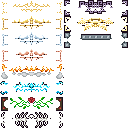

# LegendaryTooltips
A mod for Minecraft that adds fancy tooltips for rare items as well as tooltip customization options.


## Configuration & Mod Integration
The tooltips can be configured with a resource pack! This means any mod can easily add custom tooltip compatibility by just adding a data file.
To add tooltips, create `assets/legendarytooltips/tooltips.json`:
```json
{
  "tooltips":
  {
    "item.modid.fabric_item": 0,
    "block.modid.fabric_block": 2
  }
}
```
The numbers correspond to the tooltips_borders.png file, starting from the top left at zero, going down and then continuing onto the second column. The image is below:



# Example
In order from 0 to 10, top to bottom:


`assets/legendarytooltips/tooltips.json`:
```json
{
  "tooltips":
  {
    "block.minecraft.stone": 0,
    "block.minecraft.granite": 1,
    "block.minecraft.polished_granite": 2,
    "block.minecraft.diorite": 3,
    "block.minecraft.polished_diorite": 4,
    "block.minecraft.andesite": 5,
    "block.minecraft.polished_andesite": 6,
    "block.minecraft.deepslate": 7,
    "block.minecraft.cobbled_deepslate": 8,
    "block.minecraft.polished_deepslate": 9,
    "block.minecraft.calcite": 10
  }
}
```